---
presentation:

  width: 1700
  height: 1150

  margin: 0.05

  # Display controls in the bottom right corner
  controls: true

  # Display a presentation progress bar
  progress: true

  # Display the page number of the current slide
  slideNumber: true

  # Push each slide change to the browser history
  history: false

  # Enable keyboard shortcuts for navigation
  keyboard: true

  # Enable the slide overview mode
  overview: true

  # Vertical centering of slides
  center: false

  # Enables touch navigation on devices with touch input
  touch: true

  # Loop the presentation
  loop: false

  # Change the presentation direction to be RTL
  rtl: false

  # Randomizes the order of slides each time the presentation loads
  shuffle: false

  # Turns fragments on and off globally
  fragments: true

  # Flags if the presentation is running in an embedded mode,
  # i.e. contained within a limited portion of the screen
  embedded: false

  # Flags if we should show a help overlay when the questionmark
  # key is pressed
  help: true

  # Flags if speaker notes should be visible to all viewers
  showNotes: false

  # Number of milliseconds between automatically proceeding to the
  # next slide, disabled when set to 0, this value can be overwritten
  # by using a data-autoslide attribute on your slides
  autoSlide: 0

  # Stop auto-sliding after user input
  autoSlideStoppable: true

  # Enable slide navigation via mouse wheel
  mouseWheel: false

  # Hides the address bar on mobile devices
  hideAddressBar: true

  # Opens links in an iframe preview overlay
  previewLinks: false

  # Transition style
  transition: 'default' # none/fade/slide/convex/concave/zoom

  # Transition speed
  transitionSpeed: 'default' # default/fast/slow

  # Transition style for full page slide backgrounds
  #backgroundTransition: '' # none/fade/slide/convex/concave/zoom

  # Number of slides away from the current that are visible
  viewDistance: 3

  # Parallax background image
  parallaxBackgroundImage: 'https://i.gyazo.com/b0ccddff134624a2d2dc0bdaa917e393.png'

  # Parallax background size
  # parallaxBackgroundSize: "5100px 2800px"


  # Number of pixels to move the parallax background per slide
  # - Calculated automatically unless specified
  # - Set to 0 to disable movement along an axis
  parallaxBackgroundHorizontal: 200
  parallaxBackgroundVertical: 200
---

<style>
.xypic-block {
border: 2px solid #a1a1a1;
padding: 10px 40px;
border-radius: 25px;
background: #ADA996;
background: -webkit-linear-gradient(to right, #EAEAEA, #DBDBDB, #F2F2F2, #ADA996);
background: linear-gradient(to right, #EAEAEA, #DBDBDB, #F2F2F2, #ADA996);
float: center;
position: relative;
}
</style>


$$
\newcommand{\rec}{\mathop{\rm rec}\nolimits}
\newcommand{\ind}{\mathop{\rm ind}\nolimits}
\newcommand{\inl}{\mathop{\rm inl}\nolimits}
\newcommand{\inr}{\mathop{\rm inr}\nolimits}
\newcommand{\Hom}{\mathop{\rm Hom}\nolimits}
\newcommand{\Ty}{\mathop{\rm Ty}\nolimits}
\newcommand{\Tm}{\mathop{\rm Tm}\nolimits}
\newcommand{\op}{\mathop{\rm op}\nolimits}
\newcommand{\Set}{\mathop{\rm Set}\nolimits}
\newcommand{\CwF}{\mathop{\rm CwF}\nolimits}
\newcommand{\CwFB}{\mathop{\rm CwFB}\nolimits}
\newcommand{\CwFId}{\mathop{\rm CwFId}\nolimits}
\newcommand{\Cat}{\mathop{\rm Cat}\nolimits}
\newcommand{\bu}{\bullet}
\newcommand{\isContr}{\mathop{\rm isContr}\nolimits}
\newcommand{\coh}{\mathop{\bf coh}\nolimits}
\newcommand{\id}{\mathop{\rm id}\nolimits}
\newcommand{\Id}{\mathop{\rm Id}\nolimits}
\newcommand{\refl}{\mathop{\rm refl}\nolimits}
\newcommand{\J}{\mathop{\rm J}\nolimits}
\newcommand{\scol}{\mathop{\,;\,}\nolimits}
$$

<!-- slide -->
<div style="text-align:center">

## Is there something out there?

### Inferring Space from Sensorimotor Dependencies

##### Kexin Ren & Younesse Kaddar

##### *Based on* D. Philipona, J. O’Regan, and J. Nadal's 2003 article

[Documentation](https://neurorobotics-project.readthedocs.io) / [Associated Jupyter Notebook](/ipynb/neurorobotics/Inferring_Space_from_Sensorimotor_Dependencies.html)


</div>

____

<div style="text-align:left">

### Introduction: you said "space"?

____

### I. Exteroception & Compensation

### II. Mathematical formulation

### III. Algorithm

### V. Simulations and Beyond

</div>


<!-- slide data-transition="convex" data-transition-speed="slow" -->

### Introduction: you said "space"?

<span class="fragment fade-down highlight-red" data-fragment-index="1">high-dimensional sensory input vector</span><span class="fragment fade-down highlight-green" data-fragment-index="2">$\qquad \overset{\text{Brain}}{\rightsquigarrow} \qquad \underbrace{\textit{space, attributes, ...}}_{\text{easier to visualize}}$</span>

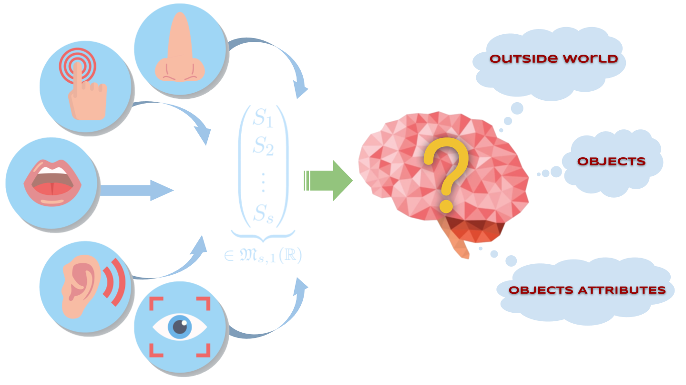

<!-- slide data-transition="zoom" data-transition-speed="slow" vertical=true -->

All the brain can do:

:   1. issue <strong class="fragment fade-down highlight-blue" data-fragment-index="1">motor commands</strong>

    2. observe the resulting <strong class="fragment fade-down highlight-green" data-fragment-index="2">environmental changes</strong>

    ⟹ *then* collect <strong class="fragment fade-down highlight-red" data-fragment-index="3">sensory inputs</strong>

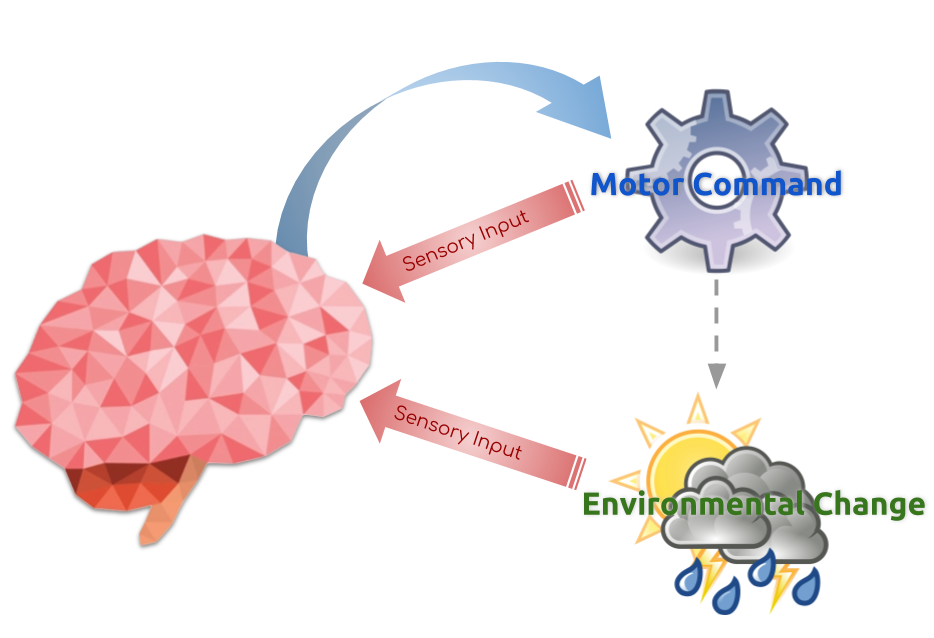


<!-- slide data-transition="concave" data-transition-speed="slow" -->

## I. - Exteroception & Compensation

### I.A Exteroception vs. Proprioception

<br>

|Sensory input|Definition|
-|-
<span class="fragment highlight-blue">*Proprioceptive*</span>|<span class="fragment highlight-blue">independent</span> of the environment
<span class="fragment highlight-green">*Exteroceptive*</span>|<span class="fragment highlight-green">dependent</span> of the environment

<br>

________________

### Example

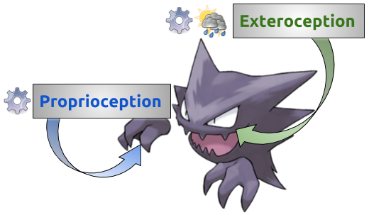

<!-- slide data-transition="convex" data-transition-speed="slow" -->

### I.B - Compensated movements

<br>

>Compensated movements:
>
>: Variations of the motor command and the environment that compensate one another.

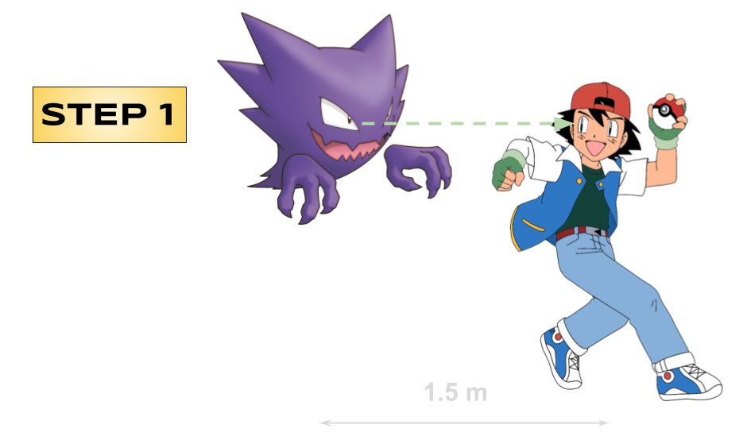


<!-- slide data-transition="concave" data-transition-speed="slow" vertical=true -->

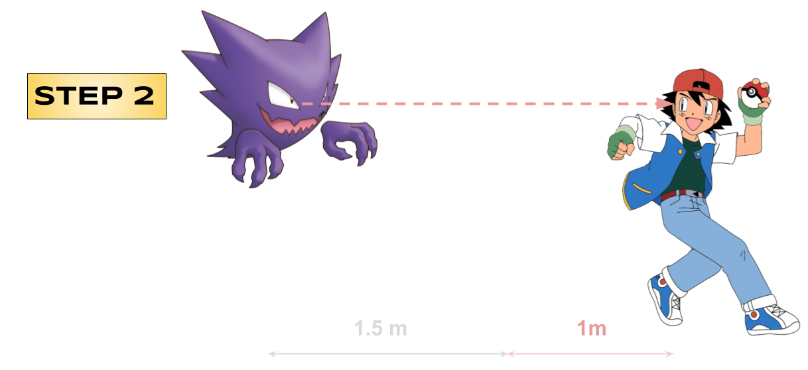
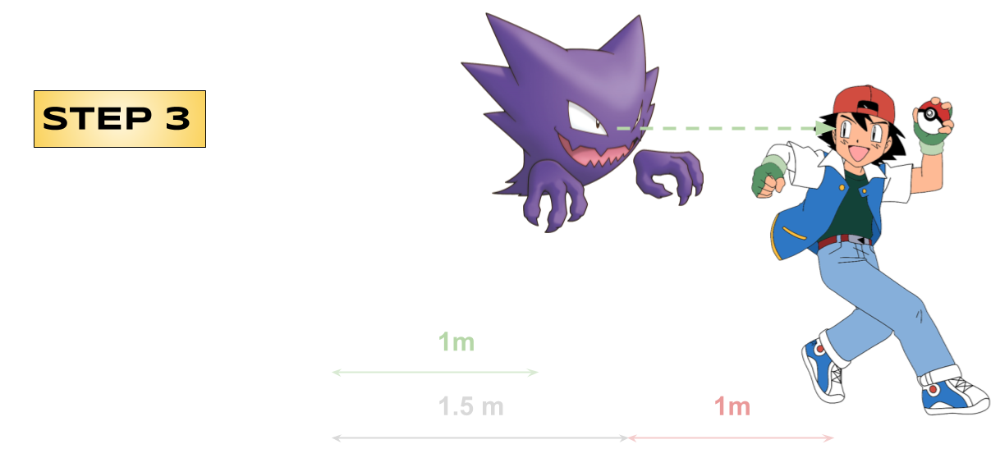

<div class="fragment fade-down"><strong>Relative distance between them</strong> is the same at steps 1 & 3</div>

<!-- slide data-transition="convex" data-transition-speed="slow" data-background-image="http://younesse.net/images/light-gradient-blue.jpg" -->

### Organism 1

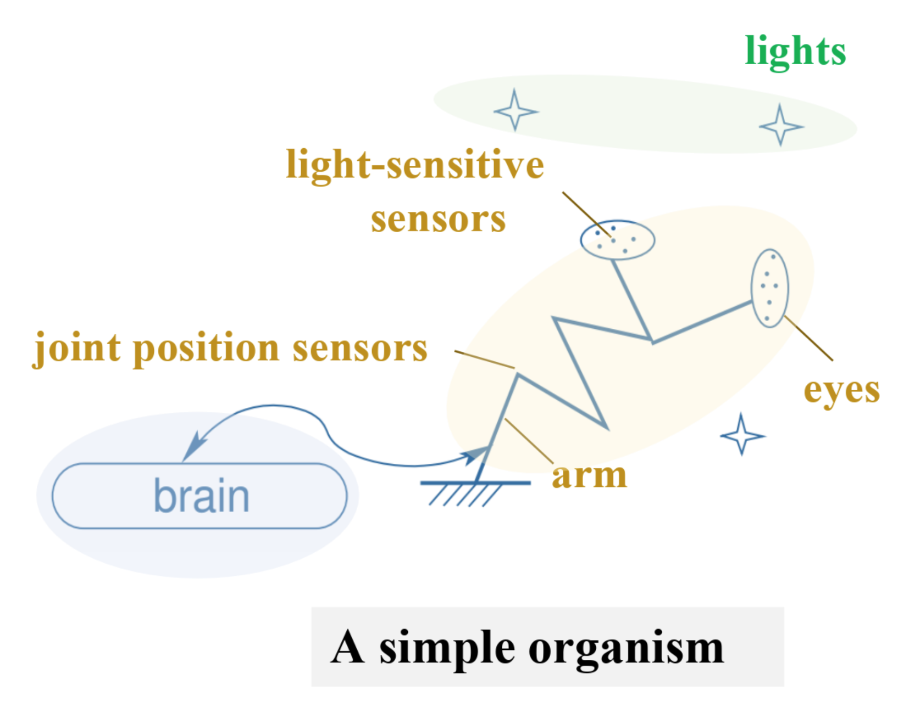

<!-- slide data-transition="convex" data-transition-speed="slow" data-background-image="http://younesse.net/images/light-gradient-blue.jpg" vertical=true -->

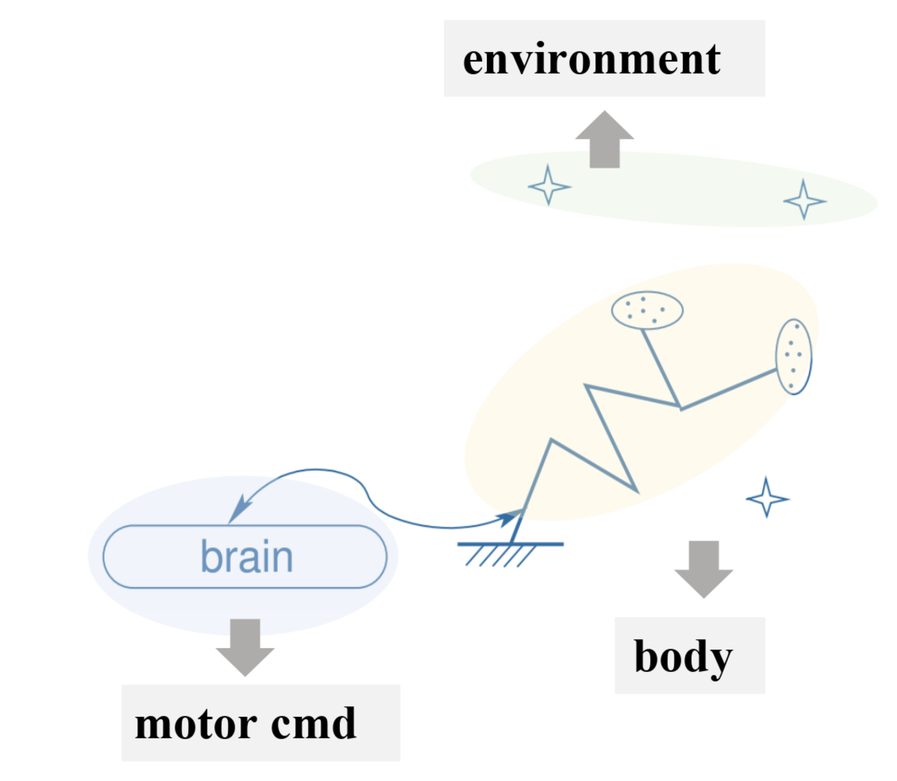

<!-- slide data-transition="convex" data-transition-speed="slow" data-background-image="http://younesse.net/images/light-gradient-blue.jpg" vertical=true -->

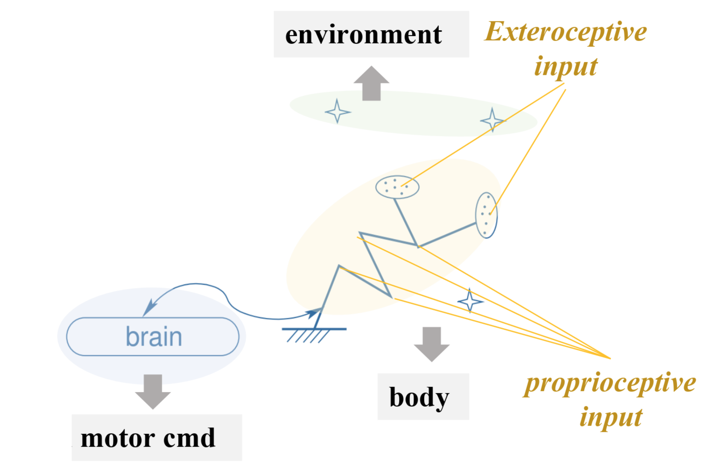

<!-- slide data-transition="convex" data-transition-speed="slow" data-background-image="http://younesse.net/images/light-gradient-blue.jpg" vertical=true -->

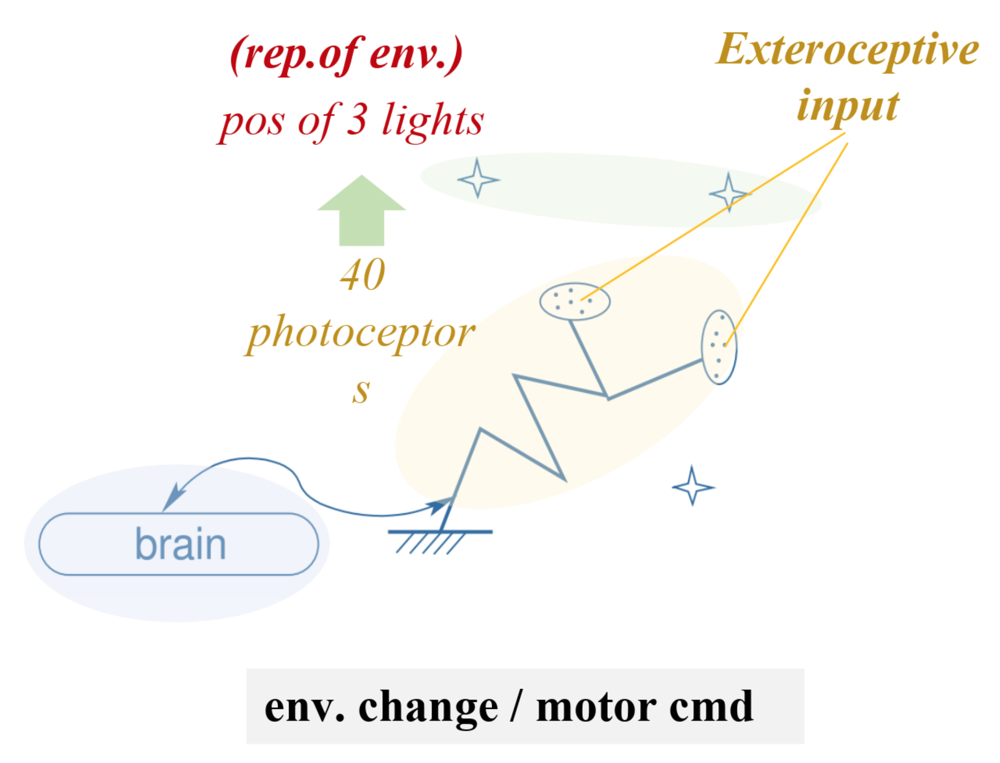

<!-- slide data-transition="convex" data-transition-speed="slow" data-background-image="http://younesse.net/images/light-gradient-blue.jpg" vertical=true -->


<!-- slide data-transition="convex" data-transition-speed="slow" data-background-image="http://younesse.net/images/light-gradient-blue.jpg" vertical=true -->

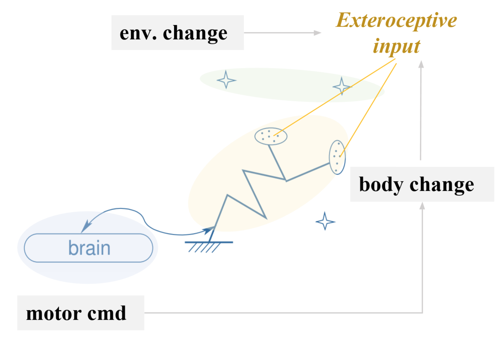

<!-- slide data-transition="convex" data-transition-speed="slow" data-background-image="http://younesse.net/images/light-gradient-blue.jpg" vertical=true -->

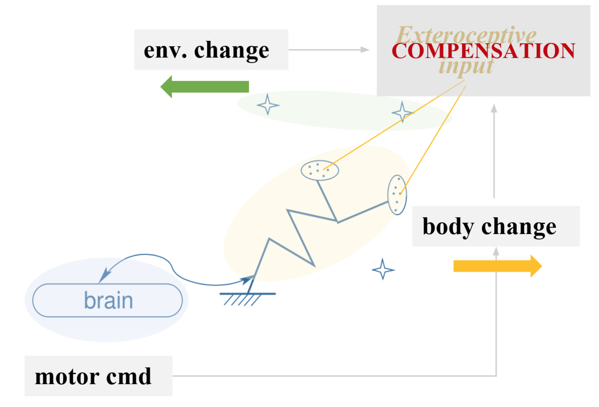


<!-- slide data-transition="convex" data-transition-speed="slow" data-background-image="http://younesse.net/images/light-gradient-blue.jpg" vertical=true -->

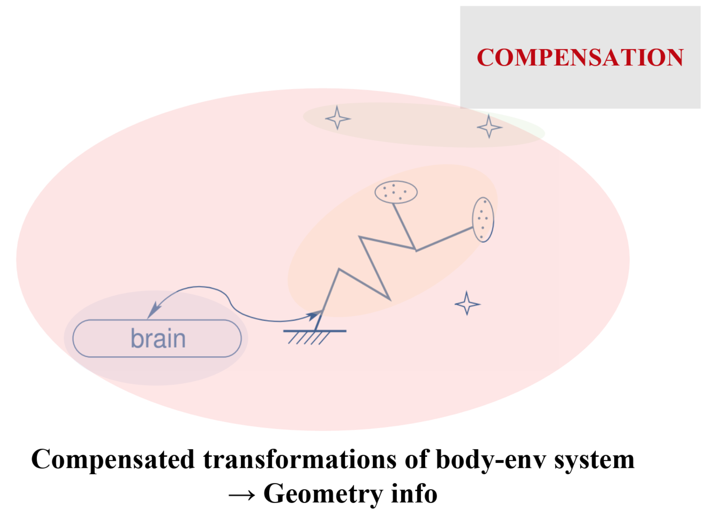

Compensable movements: **exactly what stems from the notion of the physical space in the sensory inputs**

> *So the true goal:* computing the dimension of the rigid group of compensated movements.

<!-- slide data-transition="concave" data-transition-speed="slow" -->

### II. Mathematical formulation

<br>

$$
\begin{align*}
\mathcal{E} &≝ \lbrace E ∈ \text{environmental states}\rbrace\\
\mathcal{M} &≝ \lbrace M ∈ \text{motor commands}\rbrace\\
\mathcal{S} &≝ \lbrace S ∈ \text{sensory inputs}\rbrace
\end{align*}
$$

are **manifolds** of dimension $e, m$ and $s$ respectively such that:

<br>

>$$\mathcal{S} = ψ(\mathcal{M} × \mathcal{E})$$

<br><br>

________________

<br>

**NB**: We are only considering **exteroceptive inputs**, *i.e.* points $S^e ∈ \mathcal{S}$ s.t.:

$$∃ \mathcal{M}' ⊆ \mathcal{M}; \; ψ^{-1}(S^e) = \mathcal{M}' × \mathcal{E}$$


<!-- slide data-transition="convex" data-transition-speed="slow" vertical=true -->

Pushforward of $(M_0, E_0)$ by $ψ$

⟹ Tangent space at $S_0 ≝ ψ(M_0, E_0)$:

> $$\lbrace dS \rbrace =  \lbrace dS \rbrace_{dE=0} + \lbrace dS \rbrace_{dM=0}$$

Moreover:

- $\lbrace dS \rbrace_{dE=0}$ is the tangent space of $ψ(E_0, \mathcal{M})$ at $S_0$
- $\lbrace dS \rbrace_{dM=0}$ is the tangent space of $ψ(\mathcal{E}, M_0)$ at $S_0$

<br>

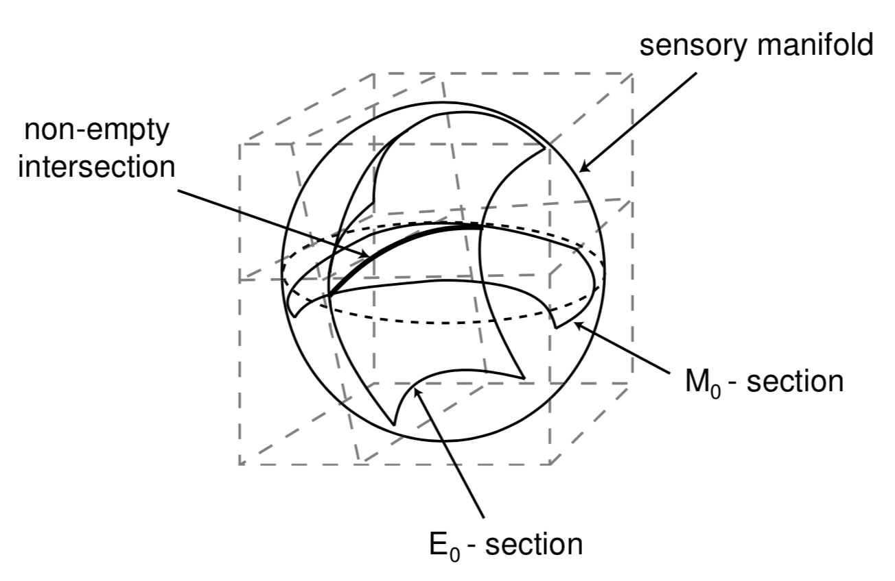

<!-- slide data-transition="convex" data-transition-speed="slow" vertical=true -->

$$\mathcal{C}(M_0, E_0) ≝ ψ(\mathcal{E}, M_0) ∩ ψ(\mathcal{E}, M_0)$$

<br>

**Along $\mathcal{C}(M_0, E_0)$:** exteroceptive changes obtained by adding

- either $dE$
- or $dM$.

<br>

________________

<br>

Compensated (infinitesimal) movements:

: when infinitesimal changes along $\lbrace dS \rbrace_{dE=0}$ and $\lbrace dS \rbrace_{dM=0}$ compensate one another

<br> <br>

Dimension of the space of compensated movements:

: $$d ≝ \dim \underbrace{\lbrace dS_{dM=0} \mid ∃ dS_{dE=0}; dS_{dM=0} + dS_{dE=0} = 0 \rbrace}_{= \; \lbrace dS \rbrace_{dE=0} ∩ \lbrace dS \rbrace_{dM=0}} = \dim \mathcal{C}(M_0, E_0)$$


<!-- slide data-transition="convex" data-transition-speed="slow" vertical=true -->

<br><br>

So **by Grassmann formula:**

<br>

>$$\begin{align*}
d \quad &≝ \quad \dim \lbrace dS \rbrace_{dE=0} ∩ \lbrace dS \rbrace_{dM=0}\\
\quad &= \quad \dim \lbrace dS \rbrace_{dE=0} + \dim \lbrace dS \rbrace_{dM=0} \\
\quad & \qquad - \dim \Big( \underbrace{\lbrace dS \rbrace_{dE=0} +\lbrace dS \rbrace_{dM=0}}_{= \lbrace dS \rbrace} \Big)\\ \\
\quad &= \quad \dim \lbrace dS \rbrace_{dE=0} + \dim \lbrace dS \rbrace_{dM=0} - \dim (\lbrace dS \rbrace)
\end{align*}$$


<!-- slide data-transition="convex" data-transition-speed="slow" -->

## Algorithm


```python

Get rid of proprioceptive inputs  # (these don't change when no motor command is issued and the environment changes)

for "source" in [motor commands, environment, both]:
    Estimate dim(space of sensory inputs resulting from "source" variations)

dim(compensated movements) =   dim(inputs resulting from motor commands variations)
                             + dim(inputs resulting from environment variations)
                             - dim(inputs resulting from both variations)
```

### Principal Component Analysis


> **Goal**: Find *orthogonal axes* onto which the *variance* of the data points under projection is *maximal*, i.e. find the *best possible "angles"* from which the data points are the most *spread out*.

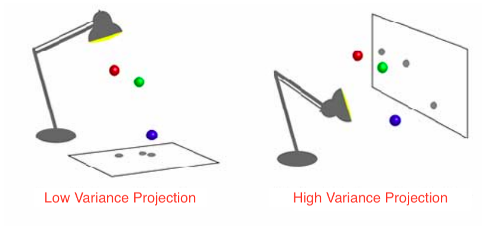


<!-- slide data-transition="convex" data-transition-speed="slow" vertical=true data-background-image="http://younesse.net/images/pixel-light.jpg" -->

### Implementation

[](https://neurorobotics-project.readthedocs.io/en/latest/?badge=latest) <iframe src="https://ghbtns.com/github-btn.html?user=youqad&repo=Neurorobotics_Project&type=watch&size=large&v=2" frameborder="0" scrolling="0" width="160px" height="44px"></iframe>

```
Neurorobotics_Project
│   index.md
│
└───sensorimotor_dependencies
│   │   __init__.py
│   │   utils.py
│   │   organisms.py
│   
└───docs
    │   ...
```

**where**

```
- utils.py ⟹ utility functions, among which dimension reduction algorithms
- organisms.py ⟹ Organism1(), Organism2(), Organism3()
```

<!-- slide data-transition="convex" data-transition-speed="slow" vertical=true data-background-image="http://younesse.net/images/pixel-light.jpg" -->

### Object-Oriented Programming

```python
class Organism1:
  def __init__(self, seed=1, retina_size=1., M_size=M_size, E_size=E_size,
               nb_joints=nb_joints, nb_eyes=nb_eyes, nb_lights=nb_lights,
               extero=extero, proprio=proprio,
               nb_generating_motor_commands=nb_generating_motor_commands,
               nb_generating_env_positions=nb_generating_env_positions,
               neighborhood_size=neighborhood_size, sigma=σ):

    self.random = np.random.RandomState(seed)

    #------------------------------------------------------------
    # Random initializations / Setting attributes

    # [...]

    self.random_state = self.random.get_state()

  def get_sensory_inputs(self, M, E, QPaL=None):
      # [...]

  def get_proprioception(self):
      # [...]    

  def get_variations(self):
    self.env_variations = ...
    self.mot_variations = ...
    self.env_mot_variations = ...

  def get_dimensions(self, dim_red='PCA'):
    self.get_proprioception()
    self.get_variations()

    # Now the number of degrees of freedom!
    self.dim_env = dim_reduction_dict[dim_red](self.env_variations)
    self.dim_extero = ...
    self.dim_env_extero = ...
    self.dim_rigid_group = ...

    return self.dim_rigid_group, self.dim_extero, self.dim_env, self.dim_env_extero
```

<!-- slide data-transition="convex" data-transition-speed="slow" vertical=true data-background-image="http://younesse.net/images/dark-background.jpg" -->

```python
>>>  O = organisms.Organism1(); O.get_dimensions()
(4, 10, 5, 11)

>>> print(str(O))
```

**Characteristics**|**Value**
-|-
Dimension of motor commands|40
Dimension of environmental control vector|40
Dimension of proprioceptive inputs|16
Dimension of exteroceptive inputs|40
Number of eyes|2
Number of joints|4
Diaphragms|None
Number of lights|3
Light luminance|Fixed
Dimension for body (p)|10
Dimension for environment (e)|5
Dimension for both (b)|11
Dimension of group of compensated movements|4


<!-- slide data-transition="convex" data-transition-speed="slow" vertical=true data-background-image=dark-background.jpg -->

# EMPTY

<!-- slide data-transition="convex" data-transition-speed="slow" vertical=true data-background-image=dark-background.jpg -->

# EMPTY


<!-- slide data-transition="convex" data-transition-speed="slow" vertical=true data-background-image=dark-background.jpg -->

# EMPTY


<!-- slide data-transition="concave" data-transition-speed="slow" -->

# EMPTY


<!-- slide data-transition="concave" data-transition-speed="slow" -->

# EMPTY

<!-- slide data-transition="convex" data-transition-speed="slow" data-background-image=dark-background.jpg vertical=true -->

# EMPTY

<!-- slide data-transition="convex" data-transition-speed="slow" data-background-image=dark-background.jpg vertical=true -->

# EMPTY

<!-- slide  data-transition="convex" data-transition-speed="slow" -->

# Conclusion
