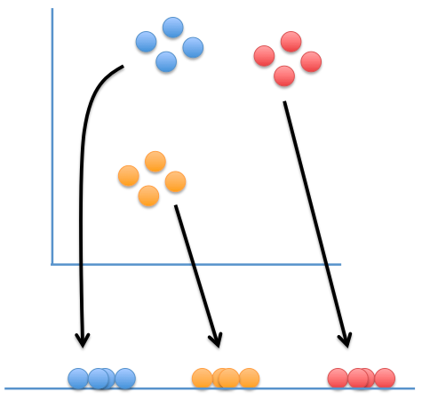
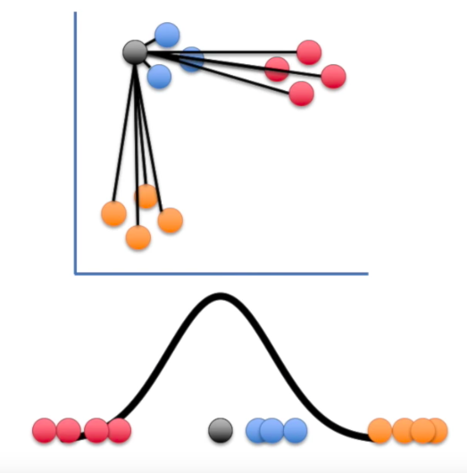
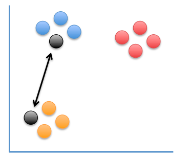
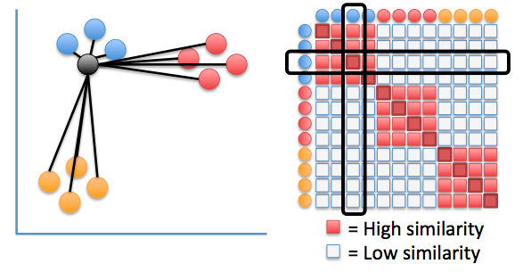
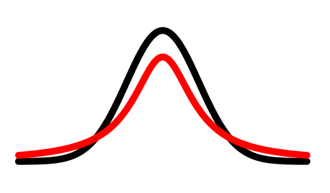
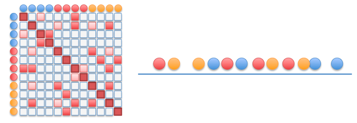
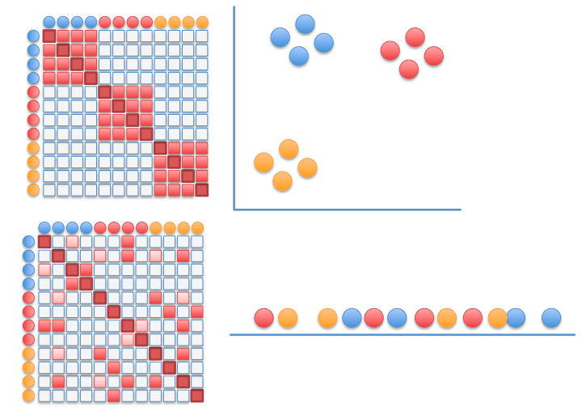
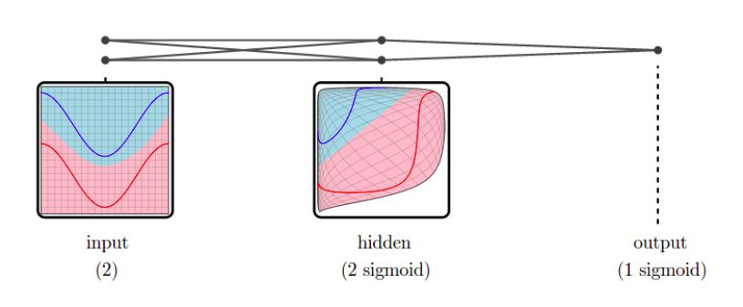
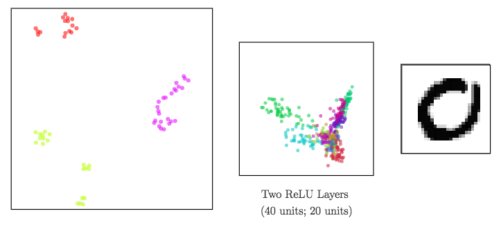
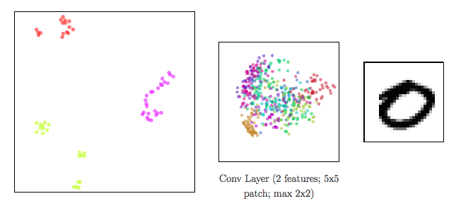

---
presentation:

  width: 1700
  height: 1150

  margin: 0.05

  # Display controls in the bottom right corner
  controls: true

  # Display a presentation progress bar
  progress: true

  # Display the page number of the current slide
  slideNumber: true

  # Push each slide change to the browser history
  history: false

  # Enable keyboard shortcuts for navigation
  keyboard: true

  # Enable the slide overview mode
  overview: true

  # Vertical centering of slides
  center: false

  # Enables touch navigation on devices with touch input
  touch: true

  # Loop the presentation
  loop: false

  # Change the presentation direction to be RTL
  rtl: false

  # Randomizes the order of slides each time the presentation loads
  shuffle: false

  # Turns fragments on and off globally
  fragments: true

  # Flags if the presentation is running in an embedded mode,
  # i.e. contained within a limited portion of the screen
  embedded: false

  # Flags if we should show a help overlay when the questionmark
  # key is pressed
  help: true

  # Flags if speaker notes should be visible to all viewers
  showNotes: false

  # Number of milliseconds between automatically proceeding to the
  # next slide, disabled when set to 0, this value can be overwritten
  # by using a data-autoslide attribute on your slides
  autoSlide: 0

  # Stop auto-sliding after user input
  autoSlideStoppable: true

  # Enable slide navigation via mouse wheel
  mouseWheel: false

  # Hides the address bar on mobile devices
  hideAddressBar: true

  # Opens links in an iframe preview overlay
  previewLinks: false

  # Transition style
  transition: 'default' # none/fade/slide/convex/concave/zoom

  # Transition speed
  transitionSpeed: 'default' # default/fast/slow

  # Transition style for full page slide backgrounds
  #backgroundTransition: '' # none/fade/slide/convex/concave/zoom

  # Number of slides away from the current that are visible
  viewDistance: 3

  # Parallax background image
  parallaxBackgroundImage: 'https://i.gyazo.com/b0ccddff134624a2d2dc0bdaa917e393.png'

  # Parallax background size
  # parallaxBackgroundSize: "5100px 2800px"

  # Number of pixels to move the parallax background per slide
  # - Calculated automatically unless specified
  # - Set to 0 to disable movement along an axis
  parallaxBackgroundHorizontal: 200
  parallaxBackgroundVertical: 200
---

$$
\newcommand{\rec}{\mathop{\rm rec}\nolimits}
\newcommand{\ind}{\mathop{\rm ind}\nolimits}
\newcommand{\inl}{\mathop{\rm inl}\nolimits}
\newcommand{\inr}{\mathop{\rm inr}\nolimits}
\newcommand{\Hom}{\mathop{\rm Hom}\nolimits}
\newcommand{\Ty}{\mathop{\rm Ty}\nolimits}
\newcommand{\Tm}{\mathop{\rm Tm}\nolimits}
\newcommand{\op}{\mathop{\rm op}\nolimits}
\newcommand{\Set}{\mathop{\rm Set}\nolimits}
\newcommand{\CwF}{\mathop{\rm CwF}\nolimits}
\newcommand{\CwFB}{\mathop{\rm CwFB}\nolimits}
\newcommand{\CwFId}{\mathop{\rm CwFId}\nolimits}
\newcommand{\Cat}{\mathop{\rm Cat}\nolimits}
\newcommand{\bu}{\bullet}
\newcommand{\isContr}{\mathop{\rm isContr}\nolimits}
\newcommand{\coh}{\mathop{\bf coh}\nolimits}
\newcommand{\id}{\mathop{\rm id}\nolimits}
\newcommand{\Id}{\mathop{\rm Id}\nolimits}
\newcommand{\refl}{\mathop{\rm refl}\nolimits}
\newcommand{\J}{\mathop{\rm J}\nolimits}
\newcommand{\scol}{\mathop{\,;\,}\nolimits}
$$

<!-- slide -->

## Is there something out there?

### Inferring Space from Sensorimotor Dependencies

##### Kexin Ren & Younesse Kaddar

##### *Based on* D. Philipona, J. O’Regan, and J. Nadal's 2003 article

[Documentation](https://neurorobotics-project.readthedocs.io) / [Associated Jupyter Notebook](/ipynb/neurorobotics/Inferring_Space_from_Sensorimotor_Dependencies.ipynb.html)

____

### Introduction: you said "space"?

____

### I. Exteroception & Compensation

### II. Mathematical formulation

### III. Algorithm

### V. Simulations and Beyond

<!-- slide data-transition="convex" data-transition-speed="slow" -->

### Introduction: you said "space"?

high-dimensional sensory input vector$\qquad \overset{\text{Brain}}{\rightsquigarrow} \qquad \underbrace{\textit{space, attributes, ...}}_{\text{easier to visualize}}$

<!-- slide data-transition="zoom" data-transition-speed="slow" vertical=true -->

All the brain can do:

:   1. issue <strong class="fragment fade-down highlight-blue" data-fragment-index="1">motor commands</strong>

    2. observe the resulting <strong class="fragment fade-down highlight-green" data-fragment-index="2">environmental changes</strong>

    ⟹ *then* collect <strong class="fragment fade-down highlight-red" data-fragment-index="3">sensory inputs</strong>

<!-- slide data-transition="concave" data-transition-speed="slow" -->

## I. - Exteroception & Compensation

### I.A Exteroception vs. Proprioception

 

|Sensory input|Definition|
-|-
*Proprioceptive*|independent of the environment
*Exteroceptive*|dependent of the environment

 

________________

### Example

<!-- slide data-transition="convex" data-transition-speed="slow" -->

### I.B - Compensated movements

 

>Compensated movements:
>
>: Variations of the motor command and the environment that compensate one another.

<!-- slide data-transition="zoom" data-transition-speed="slow" vertical=true -->

> **Relative distance between them** is the same at steps 1 & 3

<!-- slide data-transition="concave" data-transition-speed="slow" data-background-image="./background_paved.png"  -->

### Organism 1

<!-- slide data-transition="concave" data-transition-speed="slow" data-background-image="background_paved.png"  -->

<!-- slide data-transition="concave" data-transition-speed="slow" -->

### II. Mathematical formulation

 

$$
\begin{align*}
\mathcal{E} &≝ \lbrace E ∈ \text{environmental states}\rbrace\\
\mathcal{M} &≝ \lbrace M ∈ \text{motor commands}\rbrace\\
\mathcal{S} &≝ \lbrace S ∈ \text{sensory inputs}\rbrace
\end{align*}
$$

are **manifolds** of dimension $e, m$ and $s$ respectively such that:

 

>$$\mathcal{S} = ψ(\mathcal{M} × \mathcal{E})$$

  

________________

 

**NB**: We are only considering **exteroceptive inputs**, *i.e.* points $S^e ∈ \mathcal{S}$ s.t.:

$$∃ \mathcal{M}' ⊆ \mathcal{M}; \; ψ^{-1}(S^e) = \mathcal{M}' × \mathcal{E}$$

<!-- slide data-transition="convex" data-transition-speed="slow" vertical=true -->

Pushforward of $(M_0, E_0)$ by $ψ$

⟹ Tangent space at $S_0 ≝ ψ(M_0, E_0)$:

> $$\lbrace dS \rbrace =  \lbrace dS \rbrace_{dE=0} + \lbrace dS \rbrace_{dM=0}$$

Moreover:

- $\lbrace dS \rbrace_{dE=0}$ is the tangent space of $ψ(E_0, \mathcal{M})$ at $S_0$
- $\lbrace dS \rbrace_{dM=0}$ is the tangent space of $ψ(\mathcal{E}, M_0)$ at $S_0$

 

<!-- slide data-transition="convex" data-transition-speed="slow" vertical=true -->

$$\mathcal{C}(M_0, E_0) ≝ ψ(\mathcal{E}, M_0) ∩ ψ(\mathcal{E}, M_0)$$

 

**Along $\mathcal{C}(M_0, E_0)$:** exteroceptive changes obtained by adding

- either $dE$
- or $dM$.

 

________________

 

Compensated (infinitesimal) movements:

: when infinitesimal changes along $\lbrace dS \rbrace_{dE=0}$ and $\lbrace dS \rbrace_{dM=0}$ compensate one another

   

Dimension of the space of compensated movements:

: $$d ≝ \dim \underbrace{\lbrace dS_{dM=0} \mid ∃ dS_{dE=0}; dS_{dM=0} + dS_{dE=0} = 0 \rbrace}_{= \; \lbrace dS \rbrace_{dE=0} ∩ \lbrace dS \rbrace_{dM=0}} = \dim \mathcal{C}(M_0, E_0)$$

<!-- slide data-transition="convex" data-transition-speed="slow" vertical=true -->

  

So **by Grassmann formula:**

 

>$$\begin{align*}
d \quad &≝ \quad \dim \lbrace dS \rbrace_{dE=0} ∩ \lbrace dS \rbrace_{dM=0}\\
\quad &= \quad \dim \lbrace dS \rbrace_{dE=0} + \dim \lbrace dS \rbrace_{dM=0} \\
\quad & \qquad - \dim \Big( \underbrace{\lbrace dS \rbrace_{dE=0} +\lbrace dS \rbrace_{dM=0}}_{= \lbrace dS \rbrace} \Big)\\ \\
\quad &= \quad \dim \lbrace dS \rbrace_{dE=0} + \dim \lbrace dS \rbrace_{dM=0} - \dim (\lbrace dS \rbrace)
\end{align*}$$

<!-- slide data-transition="convex" data-transition-speed="slow" -->

## t-Distributed Stochastic Neighbor Embedding (t-SNE)

the relation "being neighbors"$\qquad \rightsquigarrow \qquad \underbrace{\textit{"continuous range of neighborness"}}_{\text{probability distribution}}$

________________

Map points are:

- attracted to points that are near them in the data set
- repelled by points that are far from them in the data set

 

<em class="fragment fade-in" data-fragment-index="2">Image courtesy of <a src="https://statquest.org/2017/09/18/statquest-t-sne-clearly-explained/">statquest.org</a></em>

<!-- slide data-transition="convex" data-transition-speed="slow" vertical=true data-background-image=dark-background.jpg -->

### Step 1

Compute conditional probabilities

$$p_{j\mid i} ≝ \frac{\exp(-\vert\vert x_i-x_j\vert\vert^2/2\sigma^2)}{\sum_{k\neq i}\exp(-\vert\vert x_i-x_k\vert\vert^2/2\sigma^2)}$$

> probability that $x_i$ has $x_j$ as its neighbor if neighbors were chosen according to a Gaussian distribution centered at $x_i$

 

⟶ "similarity" between data points

<!-- slide data-transition="convex" data-transition-speed="slow" vertical=true data-background-image=dark-background.jpg -->

### Step 2

Then symmetrize the conditional probabilities:

$$p_{i,j} ≝ \frac{p_{j\mid i} + p_{i\mid j}}{2n}$$

<!-- slide data-transition="convex" data-transition-speed="slow" vertical=true data-background-image=dark-background.jpg -->

### Step 3

- $y_i$'s initialized at random

- Similarities between visualization points:

    $$q_{i,j} ≝ \frac{(1+\vert\vert y_i-y_j\vert\vert^2)^{-1}}{\sum_{k\neq l}(1+\vert\vert y_i-y_l\vert\vert^2)^{-1}}$$

    ⟶ computed with resort to a Student-$t$ distribution

 

 

<!-- slide data-transition="convex" data-transition-speed="slow" vertical=true data-background-image=dark-background.jpg -->

### Step 4

- Minimize the Kullback–Leibler divergence: $C ≝ \sum_{i≠ j}p_{ij}\log {\frac {p_{i,j}}{q_{i,j}}}$, by modifying the $y_i$'s with gradient descent

- Recompute the $q_{i,j}$'s at each step (until convergence is reached)

<!-- slide data-transition="concave" data-transition-speed="slow" -->

## Dimensionality reduction to visualize high-dimensional representations

*In a neural network:*

- **input data** ⟶ shape changed from a layer to another: a *representation* is the reshaped data at a given layer.

> Since representations are high-dimensional ⟹ DR methods to visualize them

<!-- slide data-transition="concave" data-transition-speed="slow" -->

### meta-SNE to visualize the space of representations

1. Build matrices of pairwise distances: $$D_X ≝ \left(d_X(x_i, x_j)\right)_{i,j}$$ ⟹ vectorize representations

2. *Step up the ladder of abstraction*: visualize vectorized representations with t-SNE

> Regarding neural networks: meta-SNE enables us no longer to confine ourselves to comparing their outcome only, but also how they operate internally.

<!-- slide data-transition="convex" data-transition-speed="slow" data-background-image=dark-background.jpg vertical=true -->

### Sigmoid

### ReLU

<!-- slide data-transition="convex" data-transition-speed="slow" data-background-image=dark-background.jpg vertical=true -->

### CNN

<!-- slide  data-transition="convex" data-transition-speed="slow" -->

# IV. Conclusion
