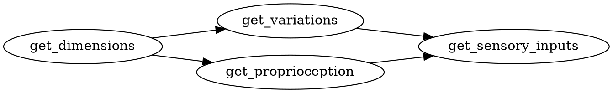

$$\underbrace{\begin{pmatrix}
    S_1 \\
    S_2 \\
    \vdots \\
    S_s
\end{pmatrix}}_{\in \; \mathfrak{M}_{s,1}(\mathbb R)}$$

```dot
digraph G {
    rankdir=LR;
    dim[label="get_dimensions"];
    var[label="get_variations"];
    sens[label="get_sensory_inputs"];
    prop[label="get_proprioception"];
    dim -> var, prop;
    var -> sens;
    prop -> sens;
  }
```
